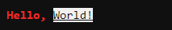

# ConsoleLog

**ConsoleLog** is a light-weight Swift command line tool optimized for Linux systems which enables you to use ANSI escape codes with built in String compatability.  It features an intuitive command line logging system which replaces simple print statements with easy to read color coded messages and a customizable interface.

## Table of Contents

- [Setup](#setup)
- [Documentation](#documentation)
  - [ANSI Escape Codes](#ansi-escape-codes)
    - [Formatting Commands](#formatting-commands)
    - [Cursor Commands](#cursor-commands)
  - [Console Logger](#console-logger)
    - [Log Categories](#log-categories)

## Setup

To use the **ConsoleLog** library in a SwiftPM project, add the following line to the dependencies in your `Package.swift` file:

```swift
.package(url: "https://github.com/Riley229/ConsoleLog.git", from: "0.2.1")
```

Then, include **ConsoleLog** as a dependency for your executable target:

```swift
let package = Package(
    // name, platform, products, etc.
    dependencies: [
        .package(url: "https://github.com/Riley229/ConsoleLog.git", from: "0.2.1")
	// other dependencies
    ],
    targets: [
        .target(
	  name: "ReallyCoolProject",
	  dependencies: ["ConsoleLog"]),
	// other targets
    ]
)
```

## Documentation

### ANSI Escape Codes

This library breaks ANSI escape codes down into 2 main categories: **Formatting Commands** and **Cursor Commands**

#### Formatting Commands

For ease of use, `String` has built-in methods for altering text appearance:

```swift
// alters the color of the text when printed to the console
func forground(_ color:ANSI.Color) -> String
func background(_ color:ANSI.Color) -> String

func bold() -> String
func faint() -> String
func underline() -> String
func blink() -> String
func reversed() -> String
```

When calling `forground()` or `background()`, you must provide a `Color`:

```swift
public enum Color {
       case black
       case red
       case green
       case yellow
       case blue
       case magenta
       case cyan
       case white
       // creates an 8-bit color from a number between 0 and 255
       case custom(UInt8)
       case `default`
       case brightBlack
       case brightRed
       case brightGreen
       case brightYellow
       case brightBlue
       case brightMagenta
       case brightCyan
       case brightWhite
}
```

The formatting applied to a `String` is self-contained and will not 'leak' into surrounding strings.  This allows you to easily create complex print statements, for example:

```swift
print("Hello, ".forground(.brightRed) + "World!".underline().reversed())
```

which outputs:



Notice how the red color applied to the first `String` don't affect the second `String`.

#### Cursor Commands

In addition to altering text appearance, ANSI escape codes allow us to manipulate the position of the cursor during printing.  The `ANSI` class supports numerous static methods that return strings which, when printed, alter the position of the cursor.  These methods include:

```swift
static public func cursorUp(_ lines:Int) -> String
static public func cursorDown(_ lines:Int) -> String
static public func cursorForward(_ lines:Int) -> String
static public func cursorBackward(_ lines:Int) -> String

static public func cursorUpLine(_ lines:Int) -> String
static public func cursorDownLine(_ lines:Int) -> String

static public func setCursorPosition(line:Int, column:Int) -> String

static public func clearScreen(_ rule:ErasureRule) -> String
static public func clearLine(_ rule:ErasureRule) -> String

static public func scrollUp(_ lines:Int) -> String
static public func scrollDown(_ lines:Int) -> String

static public var saveCursorPosition : String
static public var restoreCursorPosition : String
```

When calling `clearScreen()` or `clearLine()`, you must provide an `ErasureRule`:

```swift
public enum ErasureRule {
       // erases all content from cursor forwards
       case forward
       // erases all content from cursor backwards
       case backward
       // erases all content regardless of cursor position
       case all
}
```

All of these methods, other than `setCursorPosition`, also have an available static variable which performs the same action, filling in any arguments with `1`, or `.all` for erasure methods.

### Console Logger

To use, start by creating a `ConsoleLogger` to send your messages to:

```swift
// The name will have added uses in future versions, for now it just makes the logger easier to identity.
let log = ConsoleLogger(name:"default")
```

Now, simply log a message:

```swift
log.warning("Hello, world!")
```

which outputs:


#### Log Categories

The following log categories are supported:
- `trace`
- `debug`
- `info`
- `notice`
- `warning`
- `error`
- `critical`

To only make certain log categories print to the console, simply change the category on the `ConsoleLogger`.  Any message below the specified category will not be printed to the console.  For example:

```swift
log.category = .info
```