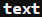
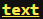

<h4 align="center">
  
  <br>
  A Swift library which provides access to ANSI commands with intuitive and easy to read methods.
  <br>
  <br>
</h4>

<p align="center">
   <a href="#setup">Setup</a> •
   <a href="#documentation">Documentation</a> •
   <a href="#release-history">Release History</a>
</p>

<br>

## Setup

**SwiftANSI** is distributed as a library through [Swift Package Manager](https://swift.org/package-manager/).  To use **SwiftANSI**, simply add it as a dependency in your project's `Package.swift` file:

```swift
// swift-tools-version:5.1

import PackageDescription

let package = Package(
    name: "ConsoleLogDemo"
    dependencies: [
        .package(url: "https://github.com/Riley229/ConsoleLog.git", from: "0.2.2")
    ],
    targets: [
        .target(
	  name: "ConsoleLogDemo",
	  dependencies: ["ConsoleLog"]),
    ]
)
```

## Documentation

### Text Coloring

<p align="center">
  
</p>

ANSI Colors are available as a property to `String`.  To color text, simply follow the 'String' with the desired colors name.  For example, `"text".red` will output .

Similarly, you can style background text by simply adding the prefix `on` before the color's name.  For example, `"text".onBlue` will produce .

Since color is available as a property to `String`, you can also combine forground and background colors together.  For example, `"text".cyan.onBrightWhite` will output .

In addition to the traditional 16 color system, **SwiftANSI** also supports 8-bit colors.  To use the custom color palette, use the `color(_:UInt8)` and `onColor(_:UInt8)` methods for forground and background colors respectively.

### Text Styling

Similar to text coloring, text styling is also available as a property to `String`.  To style a text, simply follow the `String` with a style name.  For example, `"text".bold` will produce .

Since color and style are both ANSI Attributes, you may also coombine them in a `String`.  For example, `"text".brightYellow.underline` will output .

These are the available text stylings:

- bold
- faint
- underline
- blink
- inverse

### Cursor Commands

In addition to altering text appearance, ANSI escape codes allow us to manipulate the position of the cursor during printing.  The `ANSICursor` class supports numerous static methods that return strings which, when printed, alter the position of the cursor.  These methods include:

```swift
static public func cursorUp(_ lines:Int) -> String
static public func cursorDown(_ lines:Int) -> String
static public func cursorForward(_ lines:Int) -> String
static public func cursorBackward(_ lines:Int) -> String

static public func cursorUpLine(_ lines:Int) -> String
static public func cursorDownLine(_ lines:Int) -> String

static public func setCursorPosition(line:Int, column:Int) -> String

static public func clearScreen(_ rule:ErasureRule) -> String
static public func clearLine(_ rule:ErasureRule) -> String

static public func scrollUp(_ lines:Int) -> String
static public func scrollDown(_ lines:Int) -> String

static public var saveCursorPosition : String
static public var restoreCursorPosition : String
```

When calling `clearScreen()` or `clearLine()`, you must provide an `ErasureRule`:

```swift
public enum ErasureRule {
       // erases all content from cursor forwards
       case forward
       // erases all content from cursor backwards
       case backward
       // erases all content regardless of cursor position
       case all
}
```

All of these methods, other than `setCursorPosition()`, also have an available static variable which performs the same action, filling in any arguments with `1`, or `.all` for erasure methods.

## Release History

- 0.2.2: Outsourced logging functionality to another library and made `String` methods more declarative in syntax
- 0.2.1: Removed functionality not operable on Ubuntu systems and updated documentation
- 0.2.0: Redesigned ANSI Interface and updated documentation
- 0.1.1: Corrected issue with `Package.swift`
- 0.1.0: Initial release
