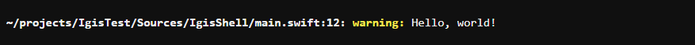

# ConsoleLog

**ConsoleLog** is a light-weight Swift command line tool which enables you to use ANSI commands with built in String compatability.  It also features an intuitive command line logging system which replaces simple print statements with easy to read color coded messages and a customizable interface.

## Table of Contents

- [Setup](#setup)
- [Documentation](#documentation)

## Setup

To use the **ConsoleLog** library in a SwiftPM project, add the following line to the dependencies in your `Package.swift` file:

```swift
.package(url: "https://github.com/Riley229/ConsoleLog.git", from: "0.2.0")
```

Then, include **ConsoleLog** as a dependency for your executable target:

```swift
let package = Package(
    // name, platform, products, etc.
    dependencies: [
        .package(url: "https://github.com/Riley229/ConsoleLog.git", from: "0.2.0")
	// other dependencies
    ],
    targets: [
        .target(
	  name: "<command-line-tool>",
	  dependencies: ["ConsoleLog"]),
	// other targets
    ]
)
```

## Documentation

To use, start by creating a `ConsoleLogger` to send your messages to:

```swift
// The name will have added uses in future versions, for now it just makes the logger easier to identity.
let log = ConsoleLogger(name:"default")
```

Now, simply log a message:

```swift
log.warning("Hello, world!")
```

which outputs:


### Log Categories

The following log categories are supported:
- `trace`
- `debug`
- `info`
- `notice`
- `warning`
- `error`
- `critical`

To only make certain log categories print to the console, simply change the category on the `ConsoleLogger`.  Any message below the specified category will not be printed to the console.  For example:

```swift
log.category = .info
```