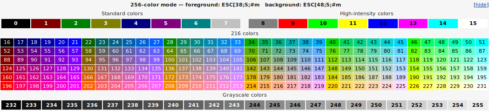

<p align="center">
  
</p>

<h4 align="center">
  SwiftANSI is a set of lightweight Swift libraries allowing easy access to ANSI commands with declarative syntax.
  <br>
</h4>

<p align="center">
   <a href="#setup">Setup</a> •
   <a href="#documentation">Documentation</a> •
   <a href="#release-history">Release History</a>
</p>

---

## Setup

**SwiftANSI** is distributed as a library through the [Swift Package Manager](https://swift.org/package-manager/).  To use **SwiftANSI** or any of its submodules, simply add the following line to the dependencies in your `Package.swift` file:

```swift
.package(url: "https://github.com/Riley229/SwiftANSI.git", from: "0.2.3")
```

Then, add **SwiftANSI** or the desired submodule(s) as a dependency for you target:

```swift
.target(name: "Demo", dependencies: [
	.product(name: "ANSIGraphics", package: "SwiftANSI")
])
```

## Documentation

**SwiftANSI** contains the following submodules:

| Submodule                     | Description                                                                                |
| ----------------------------- | ------------------------------------------------------------------------------------------ |
| [ANSIGraphics](#ansigraphics) | Manipulates terminal display attributes through SGR (Select Graphic Rendition) parameters. |
| [ANSICursor](#ansicursor)     | Provides methods to manipulate cursor position on console.                                 |

### ANSIGraphics

<p align="center">
  
</p>

ANSI Attributes are available as an extension to `String`.

To color text, simply follow the text with the desired color name.  For example, `"test".red` will output red text.  Similarly, if you add the prefix `on` to a color, you can manipulate the background text color.  For instance, `"test".onBrightBlue` will produce text on a bright blue background.  In addition to the traditional 16 color system, **ANSIGraphics** also supports 8-bit colors.  To use custom colors, use the `color(_:UInt8)` and `onColor(_:UInt8)` methods for forground and background colors respectively.

You can also apply text styles by following the `String` with a style name.  For example, `"text".bold` will produce bolded text.  Attributes can also be chained e.g. `"text".brightYellow.underline` will output bright yellow text which is underlined.

These are the available text styles (Note: not all systems support these styles):

- bold
- faint
- italic
- underline
- blink
- inverse

### ANSICursor

**ANSICursor** provides various methods to manipulate the position of the cursor.  These methods are provided through the `Cursor` class as seen below:

```swift
static public func moveUp(_ lines: Int = 1)
static public func moveDown(_ lines: Int = 1)
static public func moveForward(_ lines: Int = 1)
static public func moveBackward(_ lines: Int = 1)

static public func moveUpLine(_ lines: Int = 1)
static public func moveDownLine(_ lines: Int = 1)

static public func setPosition(line: Int, column: Int)
static public func savePosition()
static public func restorePosition()
```

## Release History

- 0.3.0: Remade **ANSICursor** as a more lightweight library and made major changes to README
- 0.2.3: Divided **SwiftANSI** into smaller modules and optimized internal calculations for ANSIStyle
- 0.2.2: Outsourced logging functionality to another library and made `String` methods more declarative in syntax
- 0.2.1: Removed functionality not operable on Ubuntu systems and updated documentation
- 0.2.0: Redesigned ANSI Interface and updated documentation
- 0.1.1: Corrected issue with `Package.swift`
- 0.1.0: Initial release
